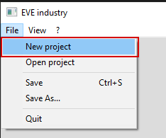

# eve industry

This project can help you get information about materials, prices, and production stages (eve online)

## Building

## Examples

[]
[]
[]
[]
[]
[]
[]
[]
[]
[]
[]
[]

## Used third-party tools
- [**wxwidgets**](https://github.com/wxWidgets/wxWidgets)
- [**boost beast**](https://github.com/boostorg/boost)
- [**openssl**](https://github.com/openssl/openssl)
- [**nlohmann/json**](https://github.com/nlohmann/json)

## License

EVE industry is licensed under the GNU GPL v3.0, see LICENSE

## Contacts:

* EVE: Kirill Dif

## CCP Copyright Notice