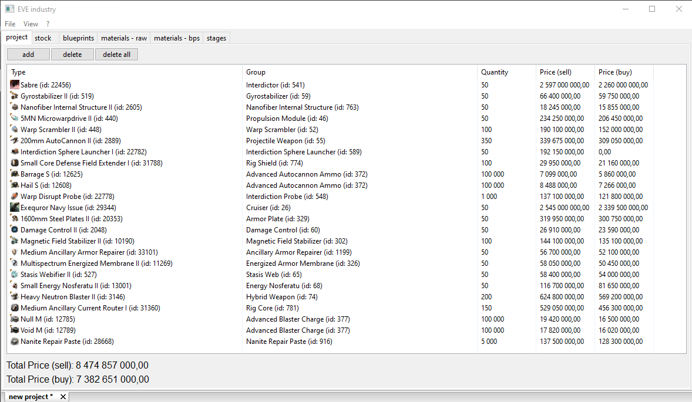
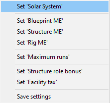
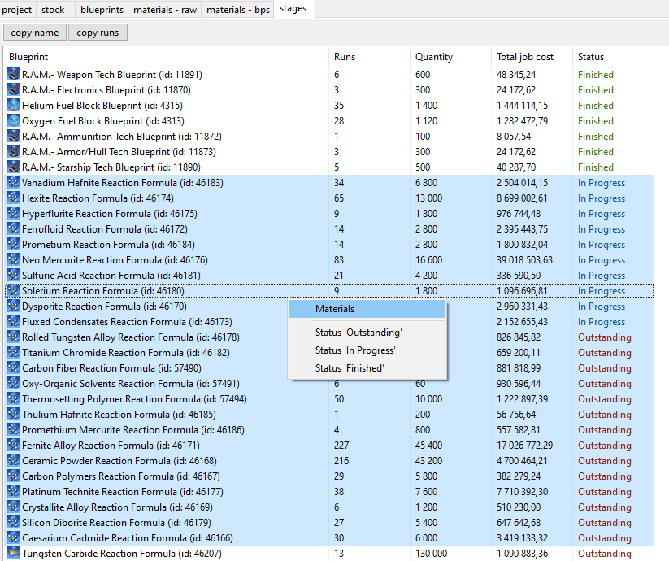
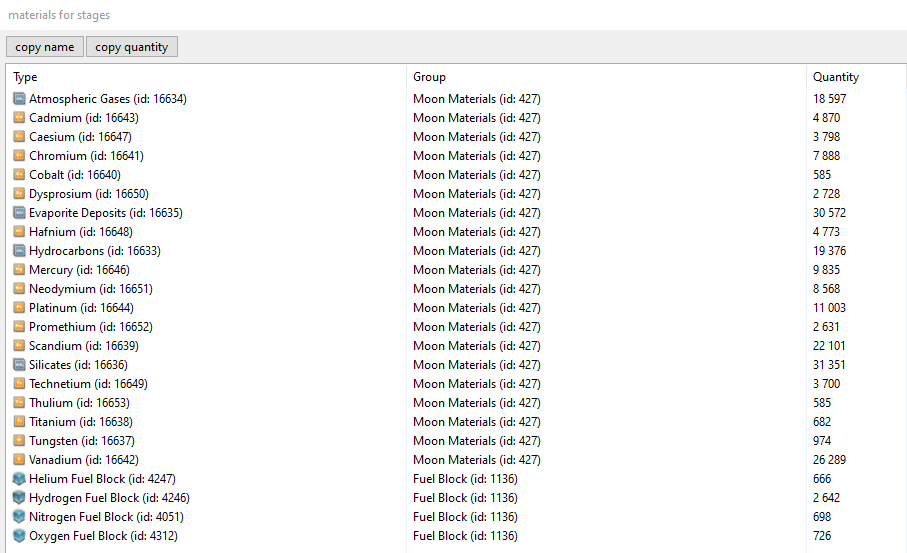

# eve industry

This project can help you get information about materials, prices, and production stages (eve online)

## Building

### Windows

```cmake
mkdir build
cd build
cmake .. -G "Visual Studio 17 2022"
cmake --build . --config Release
```

### Linux

```cmake
mkdir release
cd release
cmake -DCMAKE_BUILD_TYPE=Release ..
cmake --build . 
```

## Used third-party tools
- [**wxwidgets**](https://github.com/wxWidgets/wxWidgets)
- [**boost beast**](https://github.com/boostorg/boost)
- [**openssl**](https://github.com/openssl/openssl)
- [**nlohmann/json**](https://github.com/nlohmann/json)


## How to use

Create a new project\
\


Enter types (format: "'type' 'count'") you want to produce (or copy from the game client)\
\


Add stock (same ^^)\
\


Configure blueprints settings (solar system/bp me/structure bonus/rig bonus/max runs per one job)\


Select solar system\


and press the calculate button\


All raw materials\


All materials from blueprints\


Stages\


## License

EVE industry is licensed under the GNU GPL v3.0, see LICENSE

## Contacts:

* EVE: Kirill Dif

## CCP Copyright Notice

© 2014 CCP hf. All rights reserved. "EVE", "EVE Online", "CCP", and all related logos and images are trademarks or registered trademarks of CCP hf.