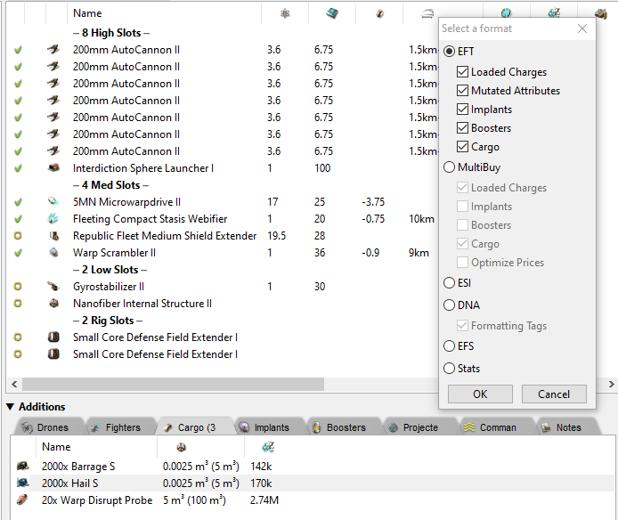
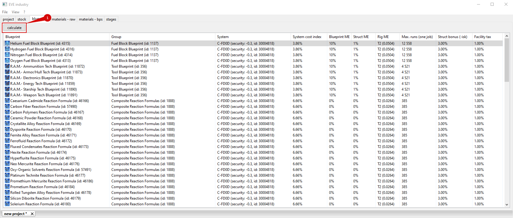
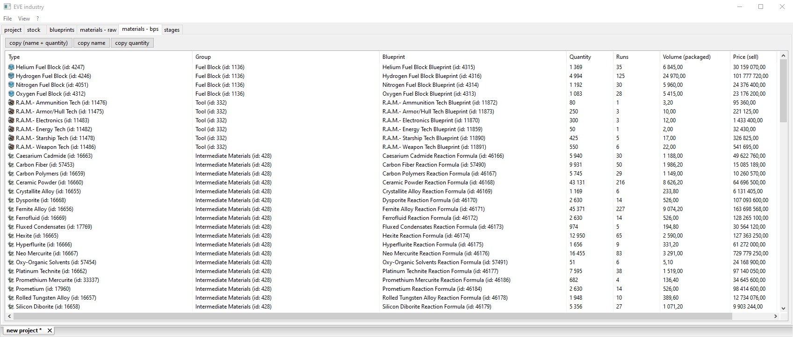

## How to use

This project can help you in mass production.\
Here will be considered an example how you can use the project for production of several ships and their fits.\
For example, you have two chars and want to use them together.\
One of them will use Sabre, second Exequror Navy Issue.\
You have their fits in pyfa or in game client.

Sabre fit

Exeq fit

Create new project

You can change name or leave default.

To add our two fits for production on 'Project' page need to press 'Add' button.\
For example, we want to create some stock of these ships with fits, so will produce them 50 pieces each.\
Copied fits from pyfa we paste (<kbd>CTRL</kbd> + <kbd>V</kbd>) in text field for adding production types and increase 'Multiply by' field to 50.\
One line - one production type. You can use list in left part for adding production types, copy from game client or simply write them in text field.\
To finish press 'OК' and all list of types that can be produced will be added to 'project' list.\
Application will gradually load cost information (Currently data loads by Jita 4-4).

List of types that were added for production:

After adding production types will update blueprints list. These are all bp that participate in production.

This list needs to be configured for getting correct list of base materials and production stages.\
By right-clicking on list will appear list of what can be configured.\
Whole list can be selected using <kbd>CTRL</kbd> + <kbd>A</kbd> combination and change settings in group.

Settings:
- Set 'Solar system': system will change resource consumption percentage (structure rigs) and system index. System index will be used for calculating job costs;
- Set 'Blueprint ME': from 0% to 10%;
- Set 'Structure ME': 0% or 1%, for player structures usually 1%;
- Set 'Rig ME': structure rig type - No rig, T1 rig, T2 rig. Percentage for T1 and T2 rigs will change depending on system (high sec, low sec, null sec, wh).
- Set 'Maximum runs': how many runs will be started in one job.
- Set 'Structure role bonus': -ISK for starting jobs. This parameter will be used for calculating job costs, by default set to 3%.
- Set 'Facility tax': set percentage TAX for starting jobs. This parameter will be used for calculating job costs, by default set to 1%.

All bps have default settings.\
By default, for all bps (originals) ME is set to 10%, T2 rig and 1% structure bonus.\
For bpc (like navy, issue, implants and similar) ME is set to 0%, T2 rig and 1% structure bonus and one run.\
For T2 bpc special settings are set depending on group (ships, modules, charges etc.).\
BP ME, structure bonus, rig bonus, number of runs - these are important configuration elements that affect final result, what quantity of base materials will be needed for production and number of stages.\
Maximum runs - pre-calculated for null sec (wh) with maximum skills and T2 rigs for speed. You also can change this parameter on page 'stages'.\
If you changed values and want to save them, you need to select rows with changed settings and choose item 'Save settings'.\
After configuration need to press 'calculate' button:

Calculation results will be available on pages:
- materials - raw: all base materials needed for production
- materials - bps: all materials that will be obtained from bp
- stages: stages that need to be completed to finish production, with job costs

materials - raw:

materials - bps:

stages:

On 'stages' page you can get quantity of materials needed to start jobs for selected stages. Since for reactions and bps (different types) there may be different structures and need to know what quantity of materials need to be moved to start jobs.

Also change stages statuses for tracking at which stage jobs are (which are completed, in progress or waiting to start).

Maybe you want to produce 400 Revelation Navy Issue with fits, because only such quantity is needed to win capital battle.\
Or produce 4000 Paladin to crash Jita market.\
Or check how many materials you need for production of PalPatine Keepstar.\
And for other options.\
I use this project because I like to use ships (modules) that were produced by me, without need to use excel, appraisal and other projects.

1. Warning!\
Use real numbers for production, what you will actually produce.\
Application doesn't limit you in quantity you want to produce (only limitation is self build-in types c++).\
Maximum quantity for production: 18446744073709500000.\
As example, you might want to produce such quantity of Sabre and will start jobs by 10 runs.\
Thus you will get such number of stages: 1844674407370950000 and these are only stages for Sabre production, need to add more stages for all reactions and others.\
Not sure that anyone's PC could 'handle' such numbers.

2. Warning!\
System indexes load once when application starts.\
System indexes are cached on ESI side (1 hour), so you may see small difference between game values and values loaded from ESI.\
Adjusted prices for calculating job costs also load once when application starts.\
Prices (buy/sell current jita 4-4) displayed in lists load once during first request.