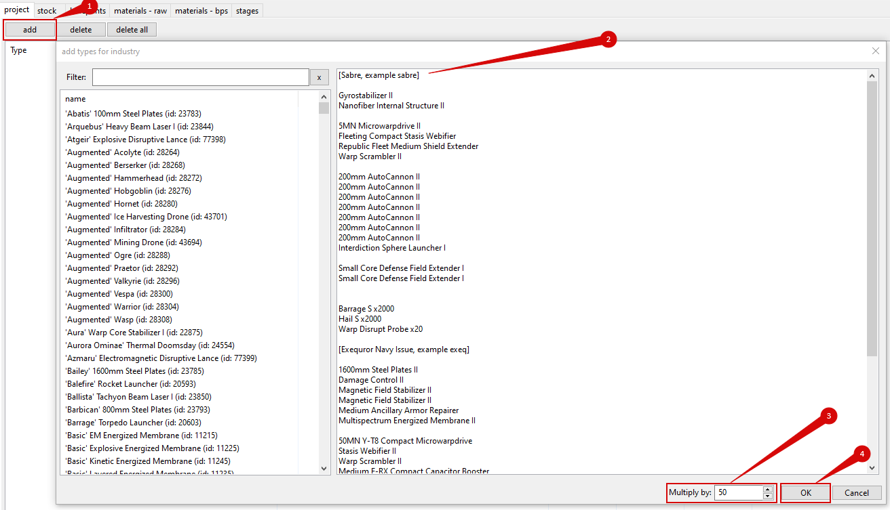

## Как использовать

Данный проект может помочь вам в массовом производстве. 
Здесь будет рассмотрен пример, как вы можете использовать проект для производства нескольких шипов и их фитов. 
Например, у вас есть два чара и вы хотите использовать их в связке. 
Один из них будет использовать Sabre, второй Exequror Navy Issue. 
У вас есть их фиты в pyfa или в клиенте игры. 
 
Sabre фит 
 
Exeq фит 
 
 
Создаем новый проект 
 
Можно поменять название или оставить по умолчанию. 
 
 
Чтобы добавить наши два фита для производства на странице 'Project' необходимо нажать кнопку 'Add'. 
Например, мы хотим создать какой-то запас данных шипов с фитами, поэтому будем производить их по 50 штук. 
Скопированные фиты из pyfa вставим (<kbd>CTRL</kbd> + <kbd>V</kbd>) в текстовое поле добавления типов для производства и увеличим поле 'Multiply by' до 50. 
Одна строка - один тип для производства. Вы можете использовать список в левой части для добавления типов для производства, скопировать из клиента игры или просто вписать их в текстовое поле. 
Для завершения нажимаем 'OК' и весь список типов, которые можно произвести, будут добавлены в список 'project'. 
Приложение постепенно загрузить информацию по стоимости (На текущий момент данные грузятся по Jita 4-4). 
 
 
Список типов, которые добавлены для производства: 
 
 
После добавления типов для производства обновится список blueprints. Это все bp, которые участвуют в производстве. 
 
 
Данный список необходимо настроить для получения корректного списка базовых материалов и стадий производства. 
По нажатию правой кнопки по списку появится список того, что можно настроить. 
Весь список можно выделить используя сочетание <kbd>CTRL</kbd> + <kbd>A</kbd> и изменять настройки группой. 
 
 
Настройки:
- Set 'Solar system': от системы будет меняться процент расхода ресурсов (риги структуры) и индекс системы. Индекс системы будет использоваться для расчета стоимости работ;
- Set 'Blueprint ME': от 0% - до 10%;
- Set 'Structure ME': 0% или 1%, для структур игрока обычно это 1%;
- Set 'Rig ME': тип риги структуры Нет риги, T1 рига, Т2 рига. процент для Т1 и Т2 риги будет меняться в зависимости от системы (high sec, low sec, null sec, wh).
- Set 'Maximum runs': сколько ранов будет запущено в одной работе.
- Set 'Structure role bonus': -ISK для запуска работ. Данный параметр будет использоваться для расчета стоимости работ, по умолчанию установлены 3%.
- Set 'Facility tax': установленный процент TAX на запуск работ. Данный параметр будет использоваться для расчета стоимости работ, по умолчанию установлен 1%.
 
Все bps имеют настройки по умолчанию. 
По умолчанию, для всех bps (оригиналы) установлен ME 10%, T2 рига и 1% бонуса структуры.
Для бпц (таких как шипы navy, issue, импы и подобные) установлен ME 0%, T2 рига и 1% бонуса структуры и один ран. 
Для T2 bpc установлены спец. настройки в зависимости от группы (шипы, модули, чарджи и т.д.).
BP МЕ, бонус структуры, бонус риги, количество ранов - это важные элементы настройки, которые влияют на конечный результат, какое количество базовых материалов будет необходимо использовать для производства и количество этапов. 
 
После настройки необходмо нажать на кнопку 'calculate'. 
 
 
Результаты расчета будут доступны на страницах:
- materials - raw: все базовые материалы, которые необходимы для производства
- materials - bps: все материалы, которые будут получены из bp
- stages: этапы, которые необходимо пройти для завершения производства, со стоимостью работ
 
materials - raw 
 
 
materials - bps 
 
 
stages 
 
 
На странице 'stages' вы можете получить количество материалов необходимых для запуска работ выделенных стадий. Так как для реакций и bps (разных видов) могут быть разные структуры и необходимо знать какое количество материала необходимо переместить для запуска работ. 
 
 
 
Также менять статусы стадий для отслеживания на какой стадии находятся работы (какие выполнены, в работе или ожидают запуска). 
 
 
Может быть вы хотите произвести 400 Revelation Navy Issue с фитами, т.к. только такое количество необходимо для победы в капитальном бою. 
Или произвести 4000 Paladin, чтобы обрушить рынок Jita. 
Или посмотреть сколько материалов вам необходимо для производства палпатин кипстара. 
И для других вариантов. 
Я использую этот проект так как мне нравится использовать шипы (модули), которые были произведены мной, без необходимости использовать excel, appraisal и др. проектов. 
 
 
Предупреждение! 
Используйте реальные числа для производства, то что вы будете производить. 
Приложение ни как не ограничивает вас в количестве, которое вы хотите произвести (ограничение только сам build-in types c++). 
Максимальное количество для производства: 18446744073709500000. 
Как пример, вы захотите произвести такое количесто Sabre и будете запускать работы по 10 ранов. 
Таким образом вы получите такое количество стадий: 1844674407370950000 и это только стадии для производства Sabre, нужно добавить еще стадии для производства всех реакций и др. 
Не уверен, что чей-либо ПК сможет 'выдержать' такие цифры.