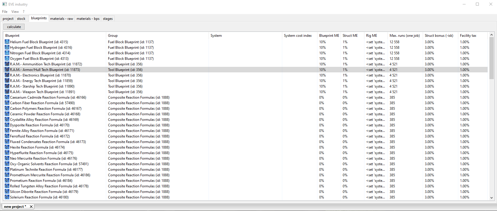
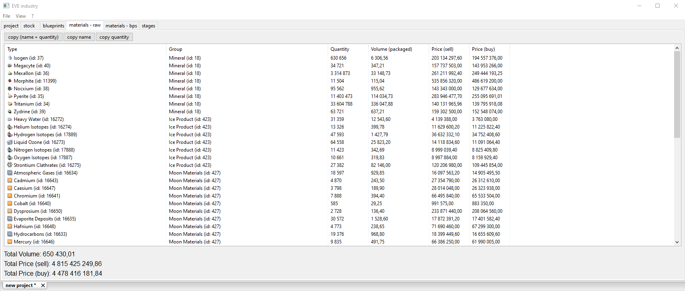

## How to use

Create a new project\
\

Enter types (format: "'type' 'count'") you want to produce (or copy from the game client)\
\

Add stock (same ^^)\
\

Configure blueprints settings (solar system/bp me/structure bonus/rig bonus/max runs per one job)\

Select solar system\

and press the calculate button\

All raw materials\

All materials from blueprints\

Stages\

